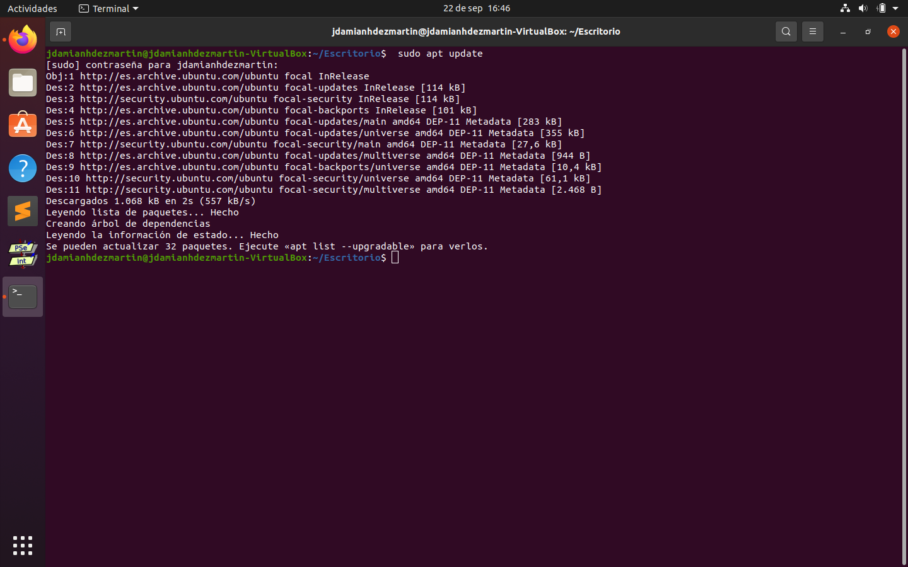
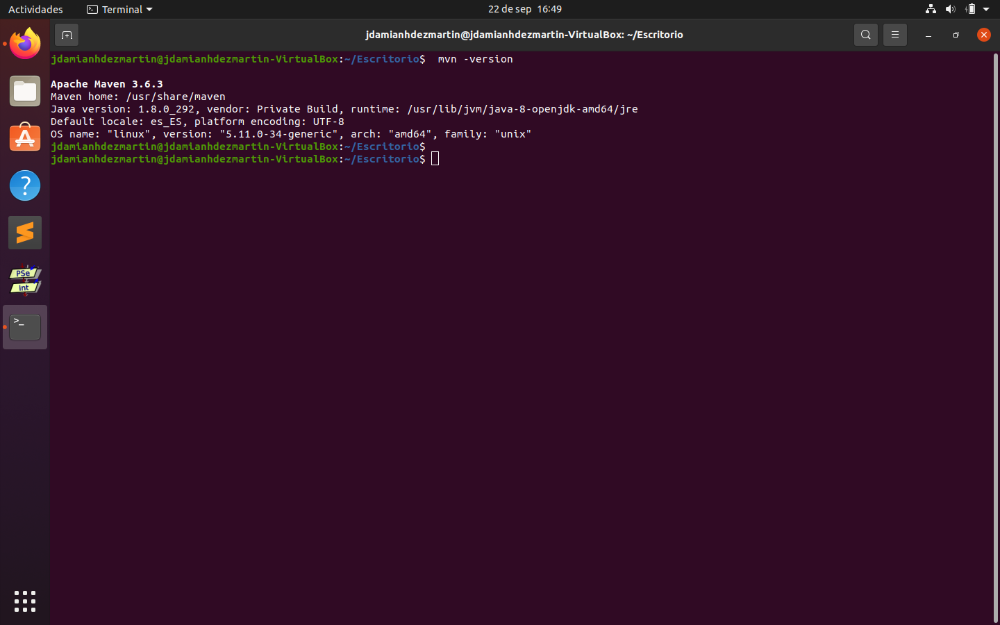
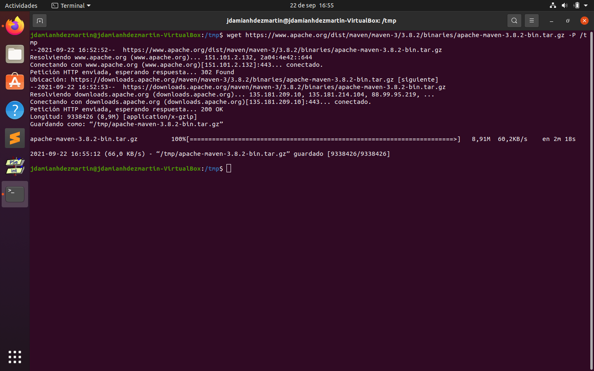
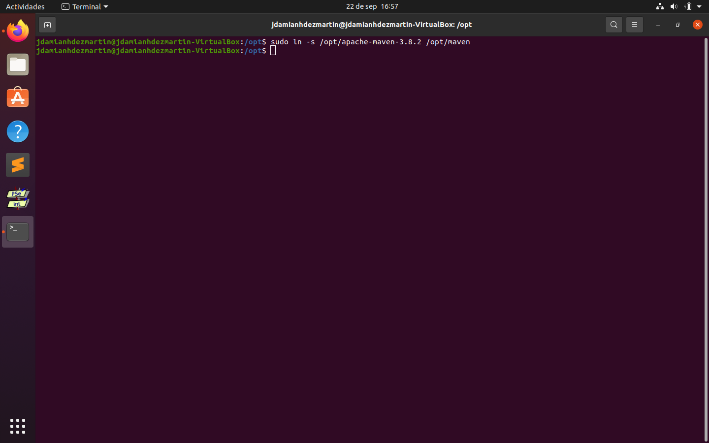
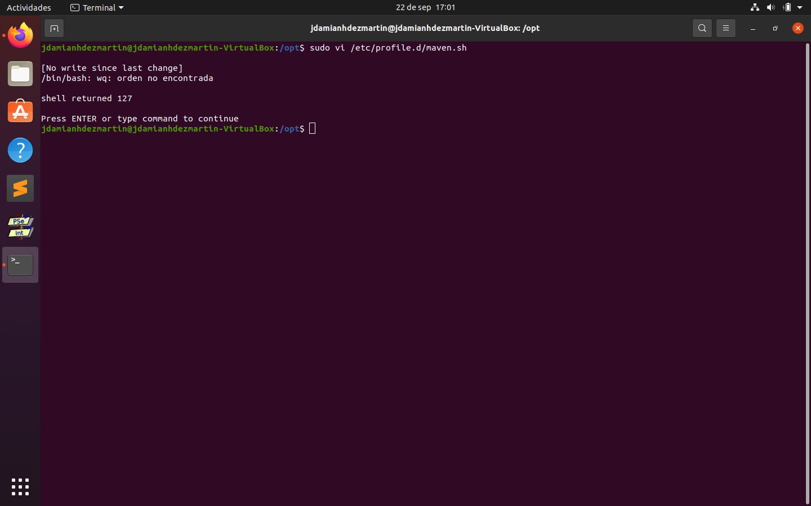
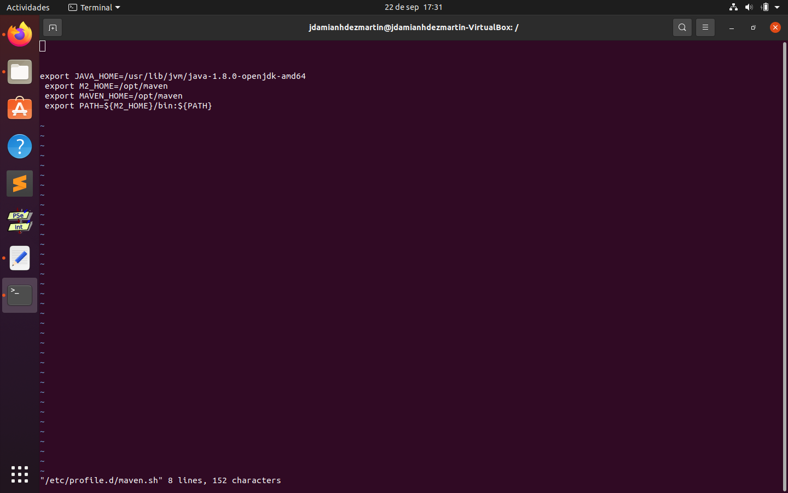
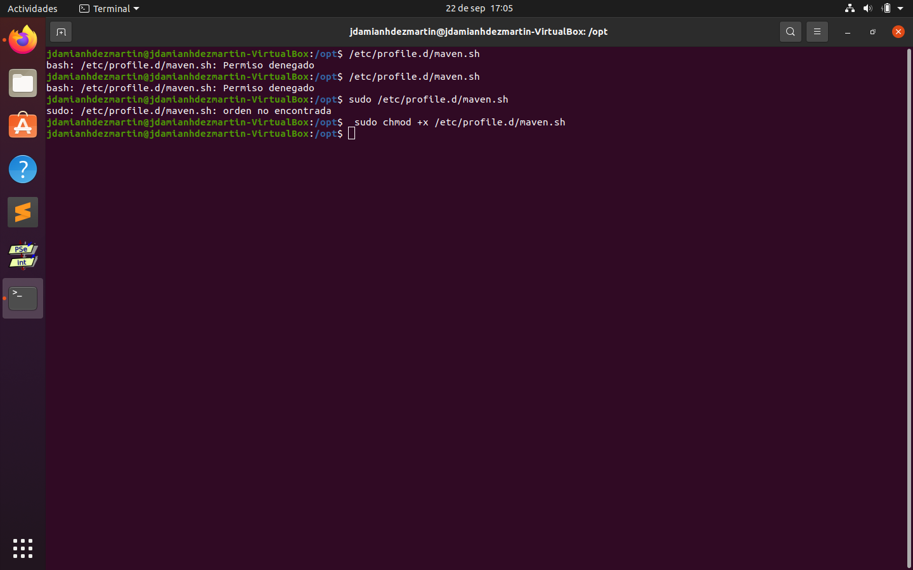
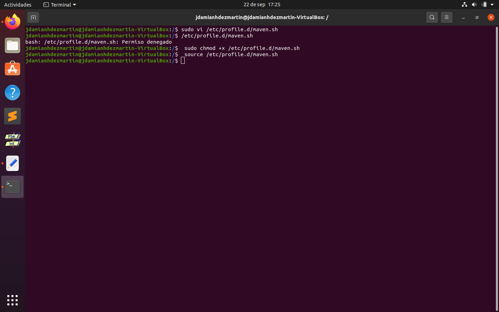
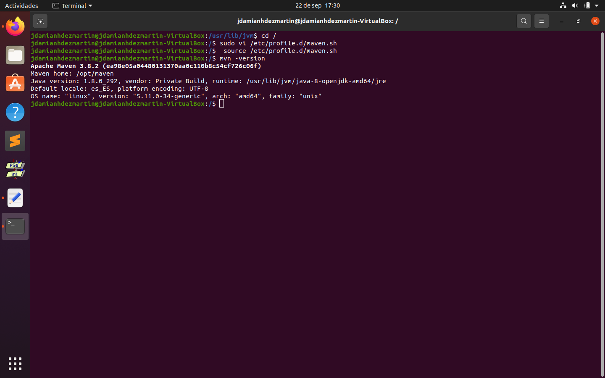

# Instalacion-de-MAVEN-en-el-Ubuntu
Guía de instalación de MAVEN en el Ubuntu

Por Jesús Damián Hernández Martín

1. [¿Qué es Maven?](#P1)

2. [¿Cómo instalar Maven en Ubuntu?](#P2)
 
3. [Pasos a seguir](#P3)

4. [Comprobación de la versión](#P4)

<div id='P1' />

### ¿Qué es Maven?
Maven es una herramienta de gestión y comprensión de proyectos java.

<div id='P2' />

### ¿Cómo instalar Maven en Ubuntu?
Instalar Maven en Ubuntu usando apt es un proceso simple y directo si se siguen los pasos explicados a continuación

<div id='P3' />

1. Introducir los siguientes comandos para actualizar el paquete e instalarlo
```bash
 sudo apt update
```
```bash
 sudo apt install maven
```


2. Verificar la versión de Maven instalada
```bash
 mvn -version
```


3. Descargue Apache Maven en el directorio /tmp
```bash
wget https://www.apache.org/dist/maven/maven-3/3.8.2/binaries/apache-maven-3.8.2-bin.tar.gz -P /tmp
```


4. Extraer el archivo en el directorio /opt
```bash
sudo tar xf /tmp/apache-maven-*.tar.gz -C /opt
```


5. Para tener más control sobre las versiones y actualizaciones de Maven, que a crear un maven enlace simbólico que apunte al directorio de instalación de Maven:

```bash
sudo ln -s /opt/apache-maven-3.8.2 /opt/maven
```


6. Abra su editor de texto, cree un nuevo archivo llamado mavenenv.sh en el directorio /etc/profile.d/ y pegue el siguiente código:
```bash
sudo vi /etc/profile.d/maven.sh

export JAVA_HOME=/usr/lib/jvm/IMPORTANTE-RESPETAR-LA-VERSION-DE-JAVA-INSTALADA
 export M2_HOME=/opt/maven
 export MAVEN_HOME=/opt/maven
 export PATH=${M2_HOME}/bin:${PATH}
```





7. Haga que el script sea ejecutable con chmod:
```bash
 sudo chmod +x /etc/profile.d/maven.sh
```



8. Cargue las variables de entorno usando el comando de source
```bash
 source /etc/profile.d/maven.sh
```



<div id='P4' />

Si quiere comprobar la versión instalada, use el mvn -version que imprimirá la versión de Maven:
```bash
mvn -version
```

Lo que debería verse en pantalla sería lo siguiente:

```bash
Apache Maven 3.8.2 (cecedd343002696d0abb50b32b541b8a6ba2883f)
 Maven home: /opt/maven
 Java version: 11.0.7, vendor: Ubuntu, runtime: /usr/lib/jvm/java-11-openjdk-amd64
 Default locale: en_US, platform encoding: UTF-8
 OS name: "linux", version: "5.4.0-29-generic", arch: "amd64", family: "unix"
```



